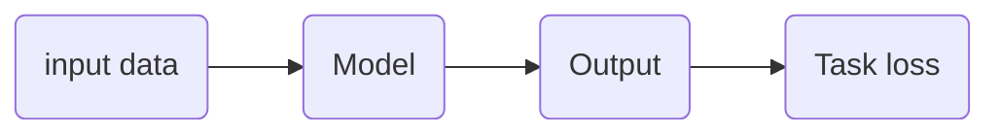

# 经典案例

> 1997年：国际象棋机器人深蓝
>
> 2016：Google AlphaGo战胜李世石
>
> 2017: Google AlphaGo完胜柯洁
>
> 2019：AlphaStar

* 模拟器到物理现实
* 鸡尾酒会问题：分离音轨、去噪
* 计算机视觉：从2D到3D
* 对经典流体物理的模仿和超越
* 精准预报极端天气
* 预测蛋白质折叠的三维结构

# 波澜历史

## 人工智能问世：

图灵测试

有30%的人认为是跟真人在聊天，即通过图灵测试

## 人工智能形成期：

理查德贝尔曼提出贝尔曼方程，奠定了强化学习基础

弗兰奇罗森布拉特提出感知机模型，是最简单的神经网络

专家系统的出现

## 人工智能暗淡期：

感知机无法解决XOR问题

机器翻译遭遇困境

计算机内存有限，运算能力不足，无法解决指数型爆炸的复杂计算问题。

## 人工智能发展期

进入稳步发展阶段（大数据、互联网、云计算）

支持向量机（SVM），有非常完美的数学理论推导做支撑（（统计学、凸优化……），深度学习出现前，被认为是近十几年来最成功的机器学习算法

# 理论基础

## 深度学习

前向传播： $f(x,w)=wx+b$

反向更新、梯度下降法、反向传播、loss函数&正则项、非线性层&激活函数、学习率&优化器

# 伟大思想

Forward：防止过拟合

Input data： 1、数据增强		2、划分领域

Model： 1、图像，文本，图		2、梯度爆炸和消失

Output：特征的使用

……
