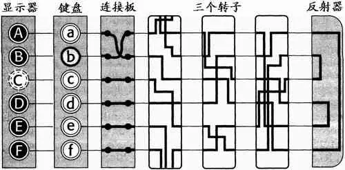

# 恩尼格玛密码机Enigma，与二战前对其的使用和研究
## 部件与工作原理
### 转子
转子是Enigma的核心部件。每个转子上都有26个不同的导线，当输入一个字母时，通过电流流过转子中的导线，就会输出另一个字母。  
当键盘上一个键被按下时，转子的方向就自动地转动一个字母的位置，得到新的字母替换规则；为了进一步增强安全性，Enigma使用了多个转子，当一个转子转动整整一圈以后，它上面有一个齿拨动下一个转子，使得它的方向转动一个字母的位置。这样，在三个转子的情况下，不重复的方向个数达到26 * 26 * 26=17576个。  
每个转子都具有可调节的初始位置——三个转子可能的初始位置显然也有17576个。另外，三个转子可以按特定顺序安装，这样又有3！=6种可能。
### 反射器
反射器使得Enigma加密、解密更加方便。当一个字母通过转子系统时，它会先经过转子的一系列变换，然后进入反射器。反射器会将字母映射到与之前不同的字母上。然后，信号再次通过转子系统，沿着相同的路径返回，最终输出加密或解密后的字母。  
稍微思考一下就可以发现：由于反射器的存在，Enigma可以实现加密、解密过程的一致性。将明文输入进行加密，与将密文输入进行解密，用的是同样的步骤。
### 连接板
连接板由一系列可以插拔的电缆组成，每个电缆上都有两个插头，用于连接字母对。通过调整这些插头的位置，可以建立字母之间的映射关系。  
连接板大大增加了暴力破解Enigma所需的枚举次数。仅仅支持两两交换6对字母的连接板，便提供了100391791500种可能。
### 
## 复杂度分析
上文提到的转子初始位置、排列顺序，与连接板字母交换情况，为Enigma提供了17576 * 6 * 100391791500种可能情况，也就是约一亿亿种的可能性。  
面对如此多的可能性，暴力破解是不可能的；而转子的独特设计，又使得Enigma成为一种复式替换系统（同一个字母可能有不同的对应方式），这使得词频分析对它无能为力。  
## 德军的使用方式
每月分发的密码本中，记有每日的daily key，包括连接板的连接、转子的顺序、转子的初始方向。 这被称为daily key。  
另一方面，每次发送电文时，操作员会首先发送一个新的密钥，更改转子的初始方向。操作员随机地选择三个字母，并为了防止出错，将其在键盘上连打两遍。（此时使用的是daily key）。接着他重新调整三个转子的初始方向为之前所选择的三个字母，然后才正式对明文加密。这被称为message key。
## 波兰密码学家Rejewski的破解
### What we already have
波兰方面每天都可以拦截到大量密文。通过“某些途径”，波兰方面获取到了上述Enigma的工作原理与德军的使用方式。不仅如此，他们还获得了某几个月的密码本。当然知道了全部这些，破译密码还是相当困难。  
### message key
注意到操作员随机选择的三个字母会在开头重复打两次——因为Enigma是复式替换，这两串字符对应的密文不会相同——而两串密文之间的关系，便为密码的破解提供了可乘之机。  
我们假设第一个字母和第四个字母都打a，那么对应密文的第一个字母可能分别是l和q。我们注意到，每个位置的字母映射规则虽然不一样，但它们都不过是字母的重排列。现在我们取遍a-z，对应密文的第一、四个字母也会取遍a-z。这样，密文第一个字母到第四个字母也构成重排列。借助简单的图论知识，我们知道这种映射可以表示成一些互不相交的环。  
不仅如此，每个位置的映射规则事实上是特殊的重排列：由上述加密、解密的对称性可知，如果a->l，那么一定有l->a。换言之，这种重排列不过是字母之间的两两交换。  
我们记第一个位置的重排列为P，第四个位置的重排列为Q，密文第一个字母到第四个字母的重排列为AD，下面的代码根据“两两交换”原则随机生成了P、Q，再生成AD，最后以一系列字母环的形式输出。
```
#include <bits/stdc++.h>

using namespace std;
int dat[26];
int P[26];
int Q[26];
int AD[26];

void printPerm(int* arr) {
  string ans;
  bool vis[26]{}; //init with false
  for (int i = 0; i < 26; i++) {
    if (vis[i]) {
      continue;
    }
    ans.push_back('(');
    while(true) {
      if (vis[i]) { //return to i
        break;
      }
      vis[i] = true;
      ans.push_back('a' + i);
      i = arr[i];
    }
    ans.push_back(')');
  }//print as circles
  cout << ans << '\n';
}

int main() {
  for (int i = 0; i < 26; i++) {
    dat[i] = i;
  }
  srand(time(nullptr));
  random_shuffle(dat, dat + 26);
  for (int i = 0; i < 26; i += 2) {
    P[dat[i]] = dat[i + 1];
    P[dat[i + 1]] = dat[i];
  }//generate P as swap
  random_shuffle(dat, dat + 26);
  for (int i = 0; i < 26; i += 2) {
    Q[dat[i]] = dat[i + 1];
    Q[dat[i + 1]] = dat[i];
  }//generate Q as swap
  for (int i = 0; i < 26; i++) {
    AD[P[i]] = Q[i];
  }//generate AD
  cout << "P: "; printPerm(P);
  cout << "Q: "; printPerm(Q);
  cout << "AD:"; printPerm(AD);
  return 0;
}
```
以下是一个典型的输出：
```
P: (al)(bj)(cp)(ds)(eo)(fh)(gt)(iq)(kr)(mw)(nv)(uz)(xy)
Q: (aq)(bj)(cm)(dn)(ex)(fz)(gi)(hy)(kr)(lt)(os)(pv)(uw)
AD:(ati)(b)(cvdoxhzw)(esnpmufy)(glq)(j)(k)(r)
```
观察AD，我们发现每个环的长度都是成对出现的：8-8，3-3，1-1，1-1。同时，还有以下结论：P、Q中的一对字母——换言之，明文和对应的密文——必然出现在AD的长度相同的两个环中。我们在此挑选出3-3的一组环，仔细观察，相信你可以发现这其中发生了什么。（当然，这些结论的严格证明需要用到置换矩阵等知识）
```
P: (al)(gt)(iq)
Q: (aq)(gi)(lt)
AD:(ati)(glq)
```
有了以上结论后，只要利用一些电文的头六个字母建立起完整的AD（以及同理的BE、CF），我们便可以快速推断出message key。比方说，如果电文的第一个字母是g，那么明文只能是a、t、或i。
### 连接板与转子
一个重要的事实是，连接板的状态不影响上述AD形如“8-8，3-3，1-1，1-1”的环的长度构成——或者说，“结构”。首先，连接板将一个输入先重排列一次，但是a-z仍然变成a-z，所以这一步完全不改变AD；经过反射后形成的密文再一次通过连接板，但只是相当于对最后的结果交换了一些字母，所以也不影响AD的结构。这样，AD的结构仅仅与转子的顺序和初始方向有关，知道了转子的内部布线，我们可以建构起17576 * 6种可能情况的“结构”对应，快速排查出转子情况。
### 内部布线
Rejewski还通过化简方程成功推断出转子与反射器的内部布线（为了量产，转子只有几种固定的型号）。所谓的“initial drum”一直困扰着他，他假定第一个转子之前还有一个固定的装置，将字母按键盘顺序映射成字母顺序，后来才发现在军用机上根本没有这玩意儿。另一个有趣的地方是，Rejewski其实只能解出最外层的转子布线，但是因为转子顺序的交换，三个转子都有了暴露在外的机会。
### 连接板
之前的工作都绕过了连接板，但是知道了message key和转子的情况，对比密文中的message key和仅仅经过转子加密的message key，获取最终的映射规则便易如反掌了。

---
上述内容只是高度简化的，对Rejewski及其同事工作的拾零。在文章*How Polish Mathematicians Deciphered the Enigma*中，还介绍了许多其它的天才想法。

***

### Credit & Reference
__Liang Alei__  
__codemate__  
<https://zhuanlan.zhihu.com/p/20263860>
### 一些感想
纵观Rejewski破解Enigma的过程，好比解一道数学难题，德军为这道题提供了种种提示，Rejewski抽丝剥茧，以优雅、严谨、数学化的方式给出解答（当然，这其中也少不了大胆猜测、情报获取、语言分析与brute force）。但凡是德军少了些疏漏，Rejewski也许就毫无头绪了；当然，也可能是Rejewski天赋异禀，总能从加密的过程中看出破绽。  
然而，随着Enigma加密技术的进步，这些方法再也行不通，二战爆发后，德军很快攻占华沙。Rejewski的成果转移到英国人手中，而他们对Enigma的破解就要“暴力”许多了。
### 下期预告 ~
__二战期间图灵对Enigma的破解__